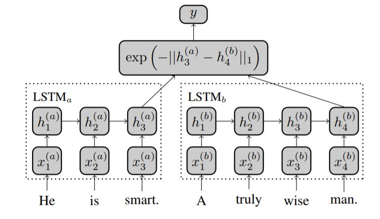
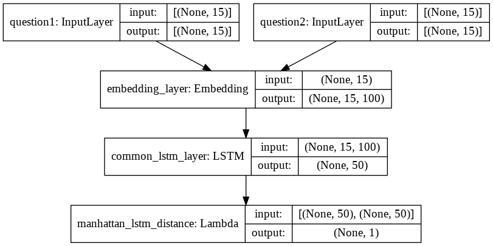

# manhattan-lstm

Implementing Manhattan LSTM, a Siamese deep network to predict semantic similarity between pairs of Quora questions.

Implementation inspired by [this paper](http://www.mit.edu/~jonasm/info/MuellerThyagarajan_AAAI16.pdf) by Mueller & Thyagarajan, and this [this Medium article](https://medium.com/mlreview/implementing-malstm-on-kaggles-quora-question-pairs-competition-8b31b0b16a07) by Elior Cohen.

## A few links

- Original research paper: [Siamese Recurrent Architectures for Learning Sentence Similarity](http://www.mit.edu/~jonasm/info/MuellerThyagarajan_AAAI16.pdf)
- The dataset can be found in './dataset' or here: [Kaggle's Quora Question Pairs Dataset](https://data.quora.com/First-Quora-Dataset-Release-Question-Pairs)
- Pretrained GloVe vectors can be found in './pretrained_embeddings' or here: [GloVe: Global Vectors for Word Representation](https://nlp.stanford.edu/projects/glove/)

## Description

The detailed explanation of the model can be found in the aforementioned paper.

A ~2% increase in accuracy was observed compared to the referenced article on making a few changes and fine-tuning the model.
- Cleaning the data was done using regular expressions, stopwords and PorterStemmer object from the NLTK library.
- The embedding matrix was created using pretrained GloVe vectors.
- The Embedding layer was made trainable.
- Adam optimizer was used with a gradient clipping of norm = 1.5.
- Binary crossentropy loss was used.

